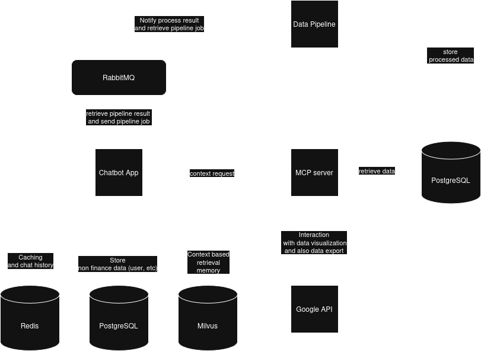
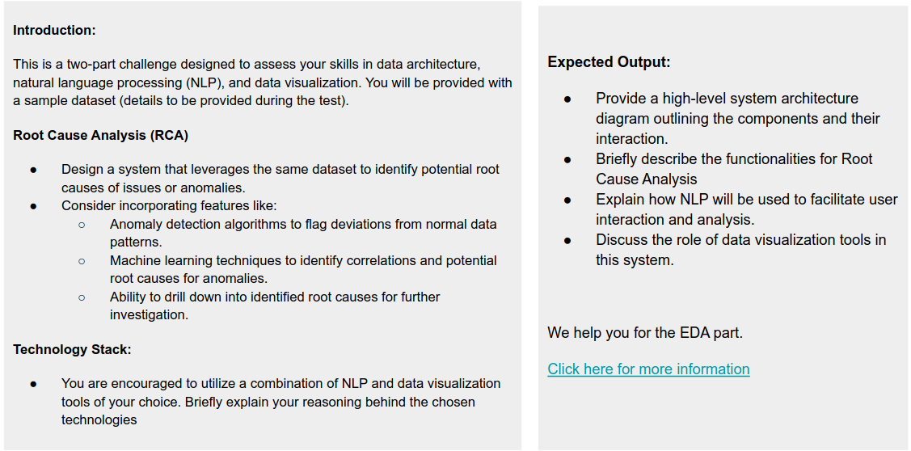
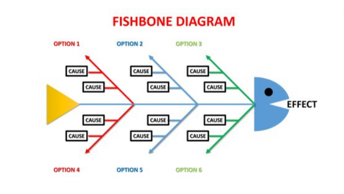

# Explainable AI

## Overview

Based on provided EDA and requirements. i came to conclusion to use this architecture diagram

this is a provided high level architecture for solving requirements described in

Based on example, here's the point i noted:

-  the app is a chatbot app
-  we can assume the data comes once a month in excel form. however, there's no guarantee that this always happens (case wrong input to pipeline)
-  we also need to log every critical operation as well (pipeline job request and results)

## Architecture

### 1. Component Interaction

#### A. Chatbot app

Chatbot app is a user interface server that handling authentication, session logging and user interaction to the main chatbot flow.

This is an n8n based flow that defines main agent of the chatbot for user interaction. it also handles caching, memory using redis and interaction with vector store based context memory based on MCP server result.

This flow also should be able to redirect the data job into data pipeline using RabbitMQ.

#### B. RabbitMQ

RabbitMQ mostly handles communication and persisting jobs to data pipeline to be processed.

it can also be used for logging later on or straight up migrate to kafka.

#### C. Data Pipeline

This is a pipeline to parse data from source, validating data, or if needed also cleansing data from the provided job. Based on case provided it can be used to preprocess the data to fits the use cases of LLM model.

Data pipeline has to be able pipe the provided data to PostgreSQL clusters for MCP server to consume.

It also can be used to fix previously wrong inputted data.

#### D. MCP Server

MCP server is a collection of tools for AI agent in n8n to interact with. it is a proxy and adapter for data source in PostgreSQL to be able dynamically handle user needs and data visualization.

Data visualization will be integrated to MCP server. it may use simple data processing like numpy, pandas, seaborn to provide model with necessary context from data window and may use google sheets API to interact and visualizing data and export it into google sheets.

## Root Cause Analysis (RCA)

Root cause analysis in this instance functions as main feature to supplement identification in irregularity and detect anomalies in data integrity.

### 1. NLP / LLM Integration

NLP or LLM can be used to integrate data retrieval and helping user to determine irregularity/anomalies and helping user to implement RCA and exploring possibilities to make informed decision based from data.

### 2. Visualization Tools

Visualization tools is needed in this instance to enchance user data understanding and can be integrated to NLP/LLM to be used.

## Technical Stack

### 1. Chatbot app

it can be using any framework to handle user interaction to chatbot. in this particular case, we use:

-  NodeJS
-  n8n
-  PostgreSQL (User operation oriented)
-  MilvusDB (Vector Memory)
-  Redis (Optional, Caching and chat history)
-  RabbitMQ producer and consumer
-  LLM Model (Claude or Deepseek for thinking model)
-  Embedding model (Mistral or nomic embedding model)
-  JWT (Optional)
-  Google Auth (Optional)

it acts as first layer for user to interact with chatbot. It handles user interaction with chatbot agent and communication with MCP server. it also creates job for data pipeline. If needed chat history can also be stored in PostgreSQL if caching deemed as non essential.

### 2. MCP server

it acts as context-provider to LLM. it uses:

-  PostgreSQL
-  Python
-  Simple data processing tools (pandas, numpy, etc)
-  Google API (google sheets API)

this server provides context to LLM and acts as multipurpose tools that handles main interaction with provided context or it can be scallably divided per context as a tool for LLM. main use cases will be to capture data window and provide it to user to be used in RCA in many form (data visualization).

### 3. Data Pipeline

it handles data parsing, validation and cleansing for big data. it uses:

-  Spark
-  Pyspark
-  RabbitMQ producer and consumer
-  PostgreSQL

## Technical Decision

### 1. n8n

n8n is a popular self-hosted workflow automation. this framework is popular and have many support in building AI workflow and integration with many systems. it also ease cognitive burden in developing `Chatbot Graph`.

### 2. Vector Based Memory

As input grows, it can be hard to track context. to make it easier and faster for model to retrieve data. Vector based memory can be used to store retrieved context from MCP.

### 3. Model Context Protocol (MCP)

MCP is a new standardized protocol for LLM model to retrieve context. it can be flexibly defined context and ensure ease in updating context retrieval.

### 4. Python

Python can leverage vast data processing support to capture window and process data to ensure SOW is fulfilled.

### 5. PostgreSQL

PostgreSQL is newer rich feature open-source database. it can use it's strict element of SQL to ensure ACID. however, if needed it also can store JSON.
