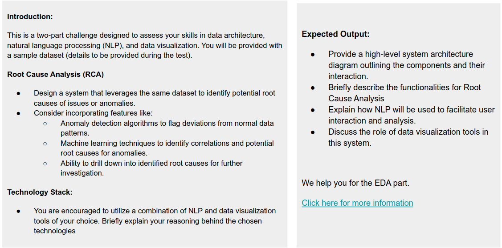

# Explainable AI

## Overview

Based on provided EDA and requirements. i came to conclusion to use this architecture diagram

this is a provided high level architecture for solving requirements described in

## Architecture

### 1. Event Driven

Based on example, here's the point i notes:

-  the app is a chatbot app
-  we can assume the data comes once a year in excel form. however, there's no guarantee that this always happens
-  as we may use ML in defining and identifying issues or anomalies, we need to train the model which can cause significant amount of time
-  we also need to log every critical operation as well (login, chat results, data request, pipeline job request and results, ML training results, etc etc)
-  user may want to identifying current data and ensure data driven decision based on previous data history without updating datasource.

this requires a fast and persistency across many type of services, hence we need an event driven architecture to solve this problem.

### 2. Component Interaction

#### A. Chatbot app

Chatbot app is a user interface server that handling authentication, session logging and user interaction to the main chatbot flow.

#### B. RabbitMQ Cluster

This is a big cluster of RabbitMQ instance where it handles most of communication and logging operation between services.

#### C. n8n Flow

This is an n8n based flow that defines main agent of the chatbot for user interaction.

This is a server based n8n framework that handles caching, memory using redis and interaction with vector store based memory based on MCP server result.

This flow also should be able to redirect the data job into data pipeline using RabbitMQ.

#### D. Data Pipeline

This is a pipeline either to only parse data from source, validating data, or if needed also cleansing data from the provided job.

Data pipeline has to be able pipping the provided data to PostgreSQL clusters for Machine Learning server and MCP server to consume.

#### E. MCP Server

MCP server is a collection of tools for AI agent in n8n to interact with. it is a proxy and adapter for ML integration and data visualization.

It retrieves model from RabbitMQ based on newest training data.

It also can interact directly with piped data in PostgreSQL clusters to be able dynamically handle user needs.

#### F. Data Visualization

Data visualization will be integrated to MCP server. this may use google sheets API to interact and visualizing data.

#### G. Machine Learning Server

This server sole purpose is to train and generate new model for MCP to consume based on newest data to ensure the model is accounted for newest dataset.

ML server will be notified by Data Pipeline using RabbitMQ to train newest set of data. it will retrieve data from PostgreSQL clusters on the range window defined and trained a outlier detection model (LOF, Isolation Forest, Etc) using the data.

ML model can also be used by MCP server in regards to predict outlier before data pipeline job is trigerred.

#### H. Logging Server

This server is optional as RabbitMQ has mostly handle all the communication and has log features that can be used.

However, it lacks of clarity in logging format. this server can be used to improve that aspects by moving logged data into ElasticSearch for easier consume.

## Root Cause Analysis by AI Agent
